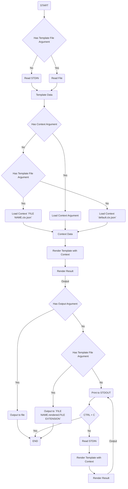
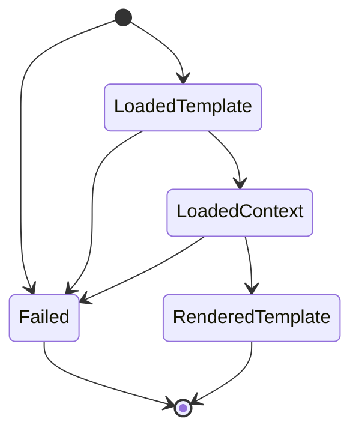

# CLI

<!--
Flowcharts Guide: https://github.com/mermaid-js/mermaid
Live Editor: https://mermaid.live
-->

## Graphs

### Core Flow

This document describes the core logical flow of the CLI, without getting into special options.

---

### CLI States

