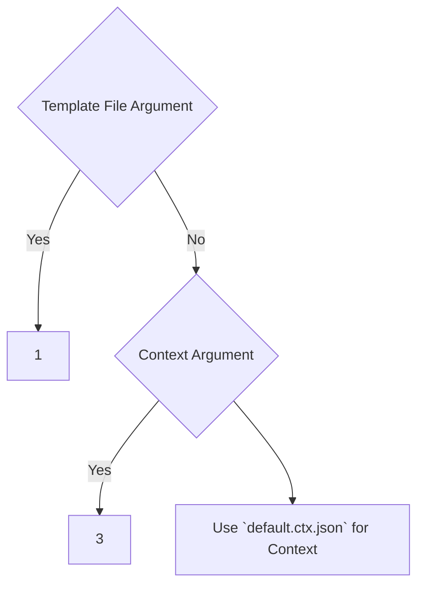

# CLI

This document describes the logical flow of CLI features.

<!--Flowcharts Guide: https://github.com/mermaid-js/mermaid-->
## Flowchart

```mermaid
graph TD;
    A{Template File Argument};
    A--> |Yes| B[1];
    A--> |No| C[2];
    C{Context Argument};
    C--> |Yes| E[3];
    C--> D[Use `default.ctx.json` for Context]
```  

TBD

